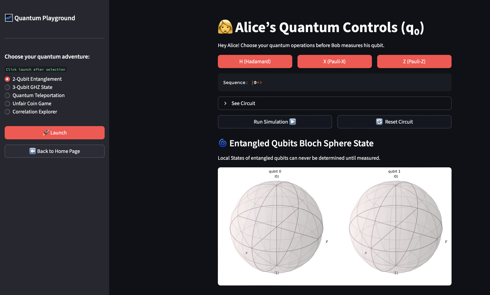
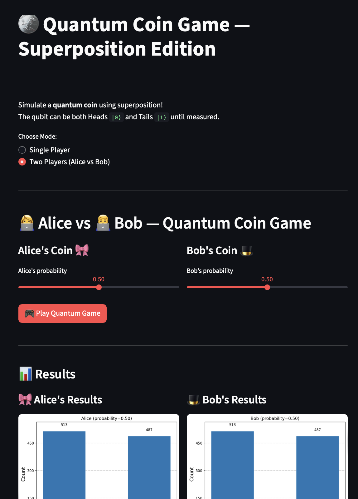
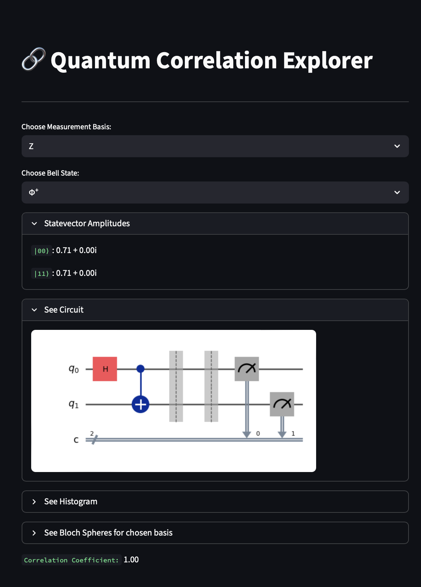

# 🌠 Aqiba's Quantum Playground

> *Explore the mysteries of quantum mechanics  one qubit at a time.*


**My Quantum Playground** is an interactive web app that lets you **visualize**, **experiment**, and **learn** quantum computing concepts right from your browser.  
Whether you're exploring **entanglement**, **superposition**, or **teleportation**, this playground brings the abstract world of qubits to life.

---

## 🏁 Live Demo

🌐 Try it on Streamlit Cloud at [quantumcomputingplayground.streamlit.app ](https://quantumcomputingplayground.streamlit.app/)<br/>
**Note:** App will only be accessible if it isn't asleep. If it sleeps, contact me to reboot.

---

## ✨ Features

🔹 **Bell State Generator**: Create and visualize all four Bell states (Φ⁺, Φ⁻, Ψ⁺, Ψ⁻).  
🔹 **Bloch Sphere Visualization**: See your qubits orientations and basis vectors in real time.  
🔹 **Quantum Circuit Builder**: Watch gates (H, X, Z, CNOT) evolve your state step-by-step.  
🔹 **Live Statevector Display**: Instantly see the amplitudes of |00⟩, |01⟩, |10⟩, and |11⟩.  
🔹 **Unfair Coin Game**: Test quantum randomness versus classical probability.  
🔹 **Correlation Explorer**: Learn how entanglement leads to quantum correlations.  
🔹 **Teleportation Demo**: Simulate the famous quantum teleportation protocol interactively.  

---

## 🧩 Tech Stack

| Component | Technology |
|------------|-------------|
| **Frontend** | [Streamlit](https://streamlit.io/) |
| **Quantum Backend** | [Qiskit](https://qiskit.org/) |
| **Visualization** | Matplotlib, Qiskit Visualizations |
| **Language** | Python 🐍 |

---

## 💻 Setup Instructions

### 1️⃣ Clone the repository
```bash
git clone https://github.com/AqibaAbdulQadir/QuantumComputing.git
cd QuantumComputing
````

### 2️⃣ Install dependencies

```bash
pip install -r requirements.txt
```

### 3️⃣ Run the Streamlit app

```bash
streamlit run app.py
```

Then open the link in your browser on localhost

---

## 📸 Screenshots 
### Exploring Entanglement

### Quantum Teleportation

### Unfair Coin Game

### Correlation Experimentor


---

## 💡 Why I Built This

This app was designed with 30+ hours of constant effort and debugging to bring to life a little idea I had in mind after the Quantum Workshop. What began as an MVP hackathon project turned in to a cool weekend pastime I couldn't help but keep developing.

It will help students, enthusiasts, and curious minds see quantum concepts come alive without writing or running any code.

It combines visual intuition (via Bloch spheres and histograms) with interactive learning making complex quantum circuits accessible, fun, and hands-on.

---
## 💖 About the Creator!

Developed with passion by **Aqiba Abdul Qadir** for TechFest'25.
