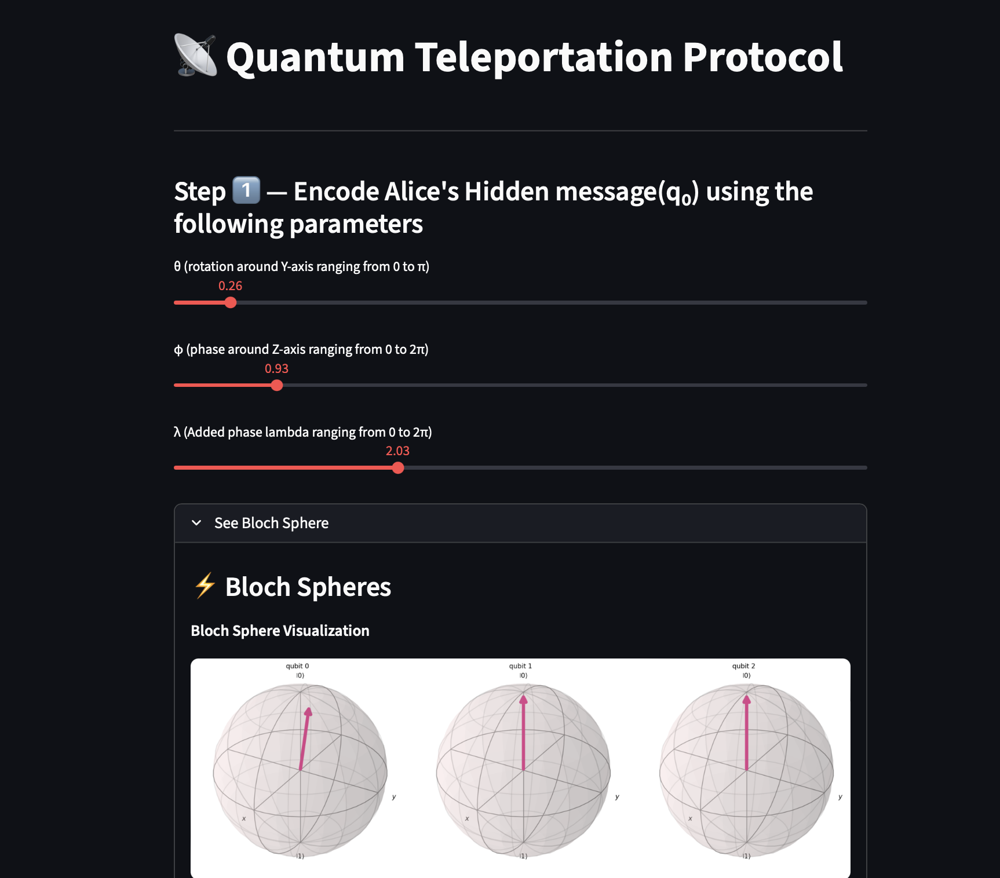

#  Aqiba’s Quantum Playground

---
> *Explore the mysteries of quantum mechanics with Sulphite one qubit at a time* :D


<p align="center">
  
  
  
</p>

**Quantum Playground** is an interactive web app that lets you **visualize**, **experiment**, and **learn** quantum computing concepts right from your browser.
Whether you're exploring **entanglement**, **superposition**, or **teleportation**, this playground brings the abstract world of qubits to life.

---

##  Live Demo

🌐 **Try it here:** [quantumcomputingplayground.streamlit.app](https://quantumcomputingplayground.streamlit.app/)

> *Note: The app may sleep after inactivity. If it’s offline, ping me to reboot it.* 

---

## Features

- 🔹 **Bell State Generator** – Create and visualize all four Bell states (Φ⁺, Φ⁻, Ψ⁺, Ψ⁻).
- 🔹 **Bloch Sphere Visualization** – Watch your qubits rotate and entangle in real-time.
- 🔹 **Quantum Circuit Builder** – See how gates like H, X, Z, and CNOT shape your state.
- 🔹 **Live Statevector Display** – Instantly view amplitudes of |00⟩, |01⟩, |10⟩, and |11⟩.
- 🔹 **Unfair Coin Game** – Experience the twist of quantum randomness.
- 🔹 **Correlation Explorer** – Explore entanglement and measure quantum correlations.
- 🔹 **Teleportation Demo** – Simulate the iconic quantum teleportation protocol.

---

## Tech Stack

| Component           | Technology                         |
| ------------------- | ---------------------------------- |
| **Frontend**        | [Streamlit](https://streamlit.io/) |
| **Quantum Backend** | [Qiskit](https://qiskit.org/)      |
| **Visualization**   | Matplotlib, Qiskit Visualizations  |
| **Language**        | Python 🐍                          |

---

## Setup Instructions

### 1️⃣ Clone the repository

```bash
git clone https://github.com/AqibaAbdulQadir/QuantumComputing.git
cd QuantumComputing
```

### 2️⃣ Install dependencies

```bash
pip install -r requirements.txt
```

### 3️⃣ Run the app

```bash
streamlit run app.py
```

Then open the local URL in your browser. 🌐

---

## 🖼️ Screenshots

### 🔮 Exploring Entanglement

<p align="center">
  
</p>

### ⚡ Quantum Teleportation

<p align="center">
  
</p>

### 🎲 Unfair Coin Game

<p align="center">
  
</p>

### 🔗 Correlation Explorer

<p align="center">
  
</p>

---

## 💡 Why I Built This

> This app was designed with over **30 hours of dedication, debugging, and late-night motivation**.
> What began as a **hackathon MVP** became a project I genuinely loved improving.

It aims to help students, enthusiasts, and curious minds **see quantum mechanics come alive**, no code required.
By combining **visual intuition** (Bloch spheres, histograms) with **interactive learning**, it makes quantum computing **accessible, fun, and hands-on**.

---

## About the Creator

Developed with passion by **Aqiba Abdul Qadir** for **TechFest’25**.

> *“Because quantum shouldn’t just be equations; it should be an experience.”* 

